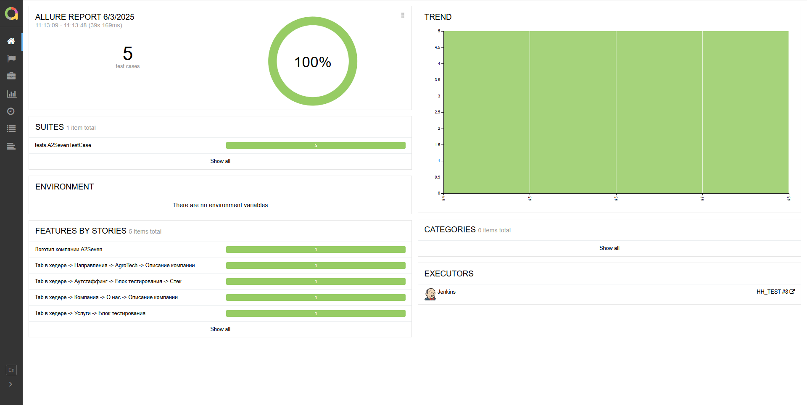
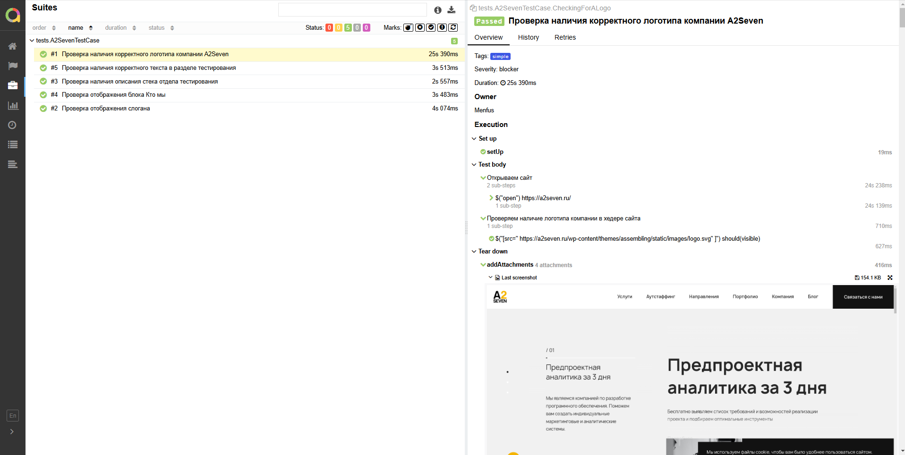
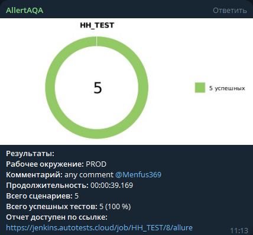
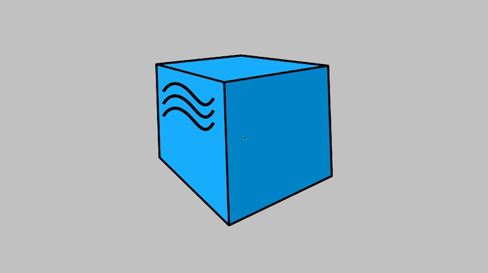

<p align="center">
  <a href="https://a2seven.ru/" target="_blank">
    
  </a>
</p>

# Проект по автоматизации тестовых сценариев для сайта компании [A2SEVEN](https://a2seven.ru/)

## Содержание
- [Технологический стек](#-технологический-стек)
- [Web-тесты](#-web-тесты)
- [Запуск тестов в Jenkins](#-запуск-тестов-в-jenkins)
- [Allure-отчет](#-allure-отчет)
- [Уведомления в Telegram](#-уведомления-в-telegram)
- [Видео с запуском тестов в Selenoid](#-видео-с-запуском-тестов-в-selenoid)

## 💻 Технологический стек

<p align="center">  
<a href="https://www.jetbrains.com/idea/"></a>  
<a href="https://www.java.com/"></a>  
<a href="https://github.com/"></a>  
<a href="https://junit.org/junit5/"></a>  
<a href="https://gradle.org/"></a>  
<a href="https://selenide.org/"></a>  
<a href="ht[images](images)tps://github.com/allure-framework/allure2"></a>  
<a href="https://www.jenkins.io/"></a> 
<a href="https://docs.docker.com//"></a>
<a href="https://docs.docker.com//"></a>
</p>

- Тесты написаны на ***Java*** с использованием фреймворка ***Selenide*** в ***IntelliJ IDEA***  
- Сборка проекта осуществляется через ***Gradle***  
- Запуск тестов в контейнерах ***Selenoid***  
- Интеграция с ***Jenkins*** + автоматическая отправка отчетов в ***Telegram***  

---

## 🌐 Web-тесты

### Основные проверки
- ✅ Проверка отображения логотипа компании
- ✅ Проверка отображения слогана компании
- ✅ Проверка наличия корректного текста в разделе "тестирования"
- ✅ Проверка наличия описания стека отдела "тестирования"
- ✅ Проверка отображения блока "Кто мы"

---

## [ Запуск тестов в Jenkins](https://jenkins.autotests.cloud/job/035-Azkeww-hw14/)

### Локальный запуск
```bash
gradle clean simple_test
```


### Удаленный запуск (Jenkins)

```bash
clean simple_test
```


## [ Allure-отчет](https://jenkins.autotests.cloud/job/HH_TEST/8/allure/)

### Главная страница Allure-отчета


### Пример отчета о выполнении тестов
Содержит в себе:
- Шаги теста
- Скриншот страницы на последнем шаге
- Page Source
- Логи браузерной консоли
- Видео прогона автотестов




##  Уведомления в Telegram

### После завершения сборки, бот, созданный в Telegram, автоматически обрабатывает и отправляет сообщение с результатом

<p align="center">

</p>

##  Видео с запуском тестов в Selenoid

<p align="center">

</p>


